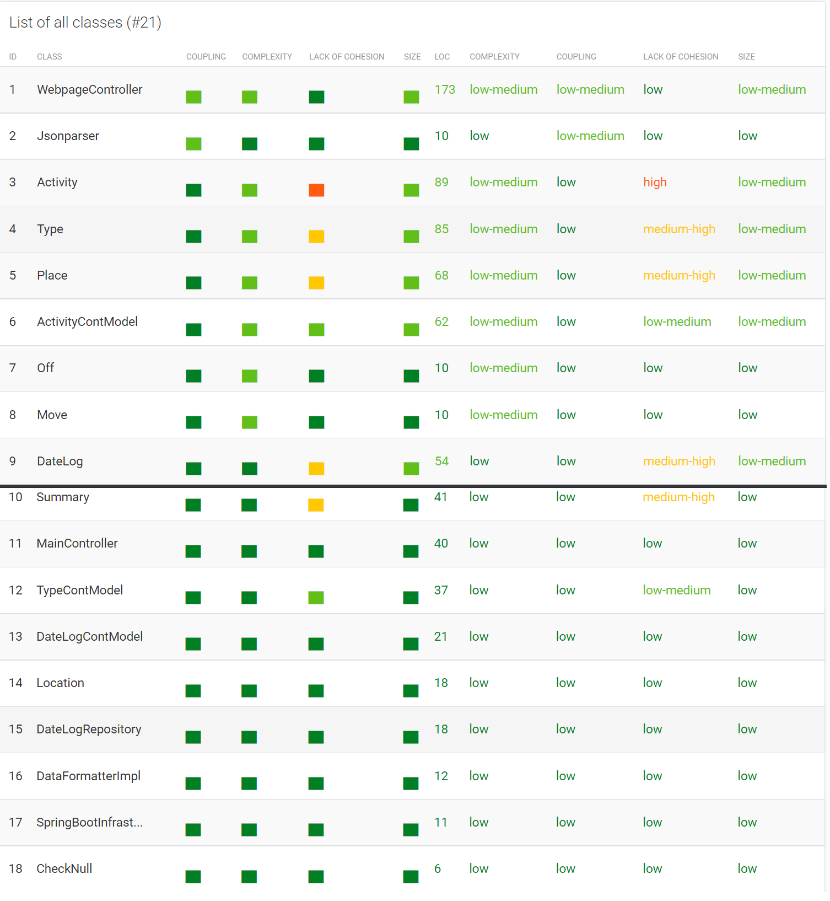

  <h1 align="center"> </img>  Health Data Tool Kit </h1>
 

<h6 align="center"> Created by Akash, Ivor, Karan </h6>

## Features Delivered
### Main Page
* Users can view their loaded data and add new data from the home page. Each entry can be further viewed with the types button. They can also be edited and deleted with the respective button.

### Add an Entry
* Database etries can be added manually from this page. Only adding the date and calories is currently supported; types and activities will be missing from these entries.

### Edit an Entry
* Date entries are edited here to change their calories idle.

### View Activity Types
* A date entry can be further expanded to view a days activities done.

### View Specific Day Activity
* Each activity can then be further examined to view what was done during that activity.

### JSON Data Loading
We used the Jackson library to load data from the JSON file into the remote database. We used annotations to specify how the json data was to ber interpreted as
a java object, and then save those objects to the database.

## How to run
Database Used:
We have used a remote database. You can look at its properties in the src/main/resources/application.properties file. In the event that the
remote database is down or the data has been erased, follow the steps below to make the program work on your local MySQL server:

### Load Data to MySQL Server via JSON
1) Edit the application properties to fit your local MySQL server's configurations.
2) Uncomment the code in the saveToRemote function in the SpringbootInfrastructureApplication class. It currently saves the first 5 records but you can
modify the code in order to save more records.
3) Run the springboot application. This will execute DDL commands and you will have a populated schema on your local server.

### Run Spring Boot Application

* Right click SpringBootInfrastructureApplication in your IDE and select run. This will load the web server and front end at http://localhost:8080/records

That's it! The remote database has been prepopulated using the commented code in the saveToRemote function in the SpringbootInfrastructureApplication class.
You can use the following REST endpoints to query the data (all of them are get operations)

## REST API
REST endpoints:
* Get all the date objects: http://localhost:8080/activitydb/datelog
* Get all the activity objects: http://localhost:8080/activitydb/activity
* Get all the move objects: http://localhost:8080/activitydb/move
* Get all the place objects: http://localhost:8080/activitydb/place
* Get all the type objects: http://localhost:8080/activitydb/type

## Code Metrics

As we can see in our code MR report, most metrics are within acceptable range except for the java objects representing tables when it comes to lack of cohesion (i.e. they had a medium to high lack of cohesion). However, since this is not an unexpected result when it comes to objects whose sole purpose is to store data, we will not concern ourselves with it too much.

## Known Problems

1) Missing add/delete functionality for activities
2) Inconvenient to load json data, since file path is hardcoded

## Resources
* Remote Database: https://db4free.net/
* Running Springboot Applications: https://docs.spring.io/spring-boot/docs/1.5.16.RELEASE/reference/html/using-boot-running-your-application.html
* Springboot and MySQL: https://spring.io/guides/gs/accessing-data-mysql/
* https://www.baeldung.com/hibernate-inheritance

## License
[MIT](https://choosealicense.com/licenses/mit/)
